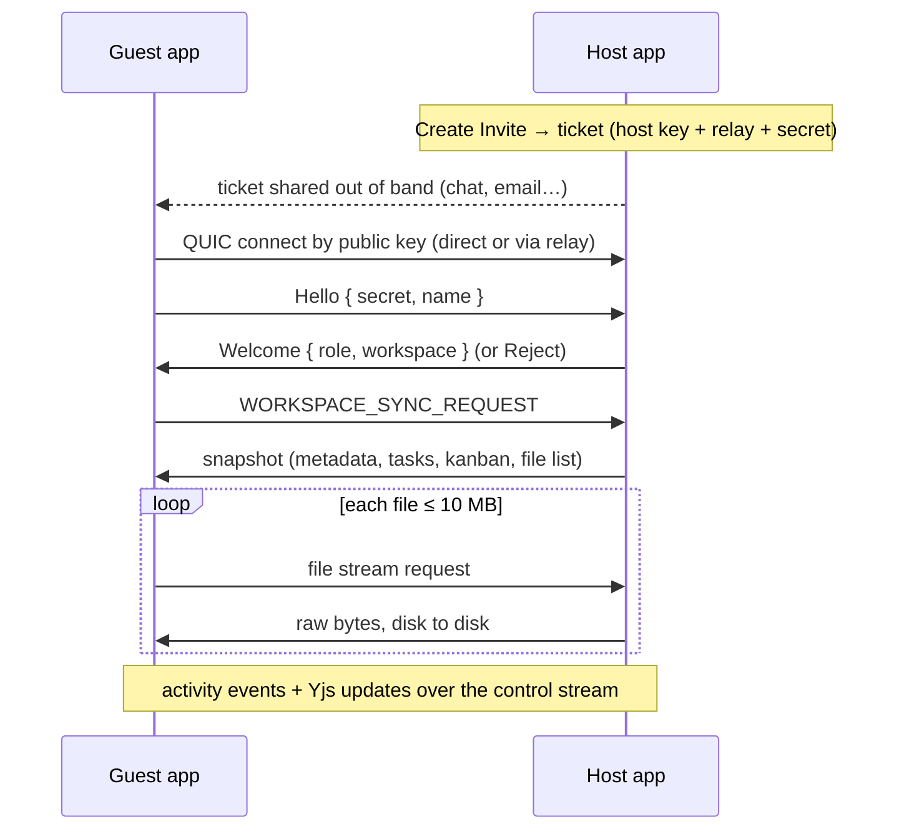

# Nexsync

Nexsync is a **local-first, peer-to-peer collaborative workspace** desktop app. Notes, code, files and assets live as normal files on your disk; tasks, kanban boards and workspace metadata live in a per-workspace SQLite database. When you want to work with someone, you share an invite and your two apps connect **directly to each other**, with no account, cloud storage or central server holding your data.

Built with [Tauri 2](https://tauri.app) (Rust) + React 19 + TypeScript, with peer-to-peer networking by [Iroh](https://www.iroh.computer).

## Features

- **Workspaces on your own disk.** Each workspace is a regular folder (`notes/`, `files/`, `assets/`, `editor/`) plus a hidden `.nexsync/` database.
- **Files, Notes and Editor.** File explorer with a BlockNote rich-text editor for Markdown and CodeMirror for code.
- **Tasks and Kanban** stored in SQLite, with a dashboard and activity feed.
- **Assets** with previews, uploads and lazy on-demand download of large files from collaborators.
- **P2P collaboration:**
    - Invite a collaborator with a single copy-pasteable ticket.
    - Connects across NATs and firewalls, with end-to-end encryption.
    - The guest gets a full copy of the workspace, and activity syncs live.

## How peer-to-peer works

All networking runs in the Rust backend (`src-tauri/src/commands/p2p/`). The React app only calls Tauri commands and listens for `p2p://*` events.

- **Identity:** each app instance runs one Iroh endpoint, identified by a public key.
- **Connectivity:** Iroh first tries to punch a direct UDP path between the two devices. If that's impossible (strict NAT, carrier-grade NAT, mobile hotspot, campus network), traffic goes through an **encrypted relay**. The relay only forwards encrypted bytes. The UI shows whether each peer is **Direct** or **Relayed**.
- **Encryption:** every connection is QUIC with TLS 1.3, authenticated by the peers' keys.
- **Invites:** a ticket (`nexsync…`) contains the host's key, home relay, a few IP hints and a random 128-bit secret. The guest proves it has the ticket by sending the secret _inside_ the encrypted connection. Creating a new invite or pressing **Stop** invalidates the previous ticket.



Files larger than 10 MB are not copied during the initial sync. They show up as **Remote** placeholders in Assets and download when you open them.

## Getting started

### Prerequisites

- [Node.js](https://nodejs.org) 22+ and [pnpm](https://pnpm.io) 9+
- [Rust](https://rustup.rs) (stable)
- Tauri's system dependencies for your OS: see [Tauri prerequisites](https://tauri.app/start/prerequisites/). On Windows this is the WebView2 runtime and the MSVC build tools.

### Run in development

```bash
pnpm install
```

```bash
pnpm tauri dev
```

### Build installers

```bash
pnpm tauri build
```

Bundles are written to `src-tauri/target/release/bundle/`. CI (`.github/workflows/build.yml`) builds the Linux AppImage and `.deb` on every push.

## Collaborating with someone

Both people need Nexsync running and an internet connection. Being on the same network is optional.

**Host (the person sharing a workspace):**

1. Open the workspace and click **P2P Sync** in the header (or **Members → P2P Sync & Invite**).
2. Pick **Editor** or **Viewer**, then click **Create Invite**.
3. Click **Copy** and send the invite to your collaborator however you like.
4. Keep Nexsync open with that workspace. The dialog shows when they connect.

**Guest (the person joining):**

1. On the Welcome screen click **Join Workspace**.
2. Paste the invite, choose where to store your copy, and enter your name.
3. Click **Connect & Join Workspace**. Nexsync creates a local copy, then downloads the host's tasks, kanban board and files.

If you already have the synced workspace open, use **P2P Sync → Join with Invite** instead. **Peers → Pull from Host** fetches the latest snapshot again.

**Troubleshooting**

- _"Timed out reaching the host"_: the host closed the app, switched workspaces, or one of you is offline.
- _"This invite has expired or been replaced"_: the host created a newer invite or pressed Stop. Ask for a fresh one.
- The first time Nexsync opens a network connection, Windows or macOS may ask whether to allow it. Allowing it on private networks enables direct (non-relayed) connections.
- The storage folder you pick must be inside an allowed root (Documents or your home folder by default, configurable in **Settings**).

## Security model

- Only someone holding a current invite can join, and each invite secret is 128 bits of randomness checked in constant time.
- Peers can read only files inside `notes/`, `files/`, `assets/` and `editor/` of the workspace that is currently open. Hidden files and the `.Nexsync/` database are never served, and every path is checked against traversal.
- Closing or switching workspaces disconnects all peers and revokes the invite.
- A guest applies a workspace snapshot only if it asked for one, so a peer can't push changes into your workspace unprompted.
- Relays and discovery use n0's public infrastructure. They can see that two endpoint keys are talking, but not what they say.

## Current limitations

- **Star topology:** guests talk to the host, not to each other, so one guest's changes don't reach another guest yet.
- **Roles are informational:** the `Viewer` role is shown but not yet enforced on incoming changes.
- **Pull overwrites:** re-syncing from the host overwrites local copies of files ≤ 10 MB rather than merging edits.
- **No live co-editing in the editors yet:** the Yjs sync provider (`createSyncProvider`) exists but isn't wired into BlockNote/CodeMirror.
- **Public relays:** n0's public relays are meant for development and light use. A production deployment should run its own [iroh-relay](https://github.com/n0-computer/iroh).

## Project structure

```
src/                         React frontend
  components/                UI components and dialogs (P2PConnectDialog, JoinWorkspaceDialog, …)
  pages/                     Welcome, Settings and workspace pages
  store/workspace/           Workspace state (WorkspaceContext)
  store/p2p/                 P2P state: peers, invites, snapshot sync (P2PContext)
  lib/tauri.ts               Typed wrappers for backend commands
  lib/p2p/                   P2P transport bridge, message types, Yjs sync provider
  lib/yjs/                   Yjs → SQLite persistence provider
src-tauri/src/
  commands/workspace/        Workspace lifecycle, filesystem, tasks, kanban, Yjs storage
  commands/p2p/              Iroh node, invite tickets, wire protocol, file streaming
  commands/config.rs         Allowed workspace roots
  commands/path_utils.rs     Path sandboxing
  database/                  SQLite connection and schema migrations
```

## Testing

Checks run from `src-tauri/`:

```bash
cargo test
```

The end-to-end P2P test starts a real host and guest over the Iroh network. It checks joining, two-way messaging, file streaming, rejection of forged and revoked invites, and disconnect handling. It needs internet access, so it's skipped by default:

```bash
cargo test test_host_and_guest_end_to_end -- --ignored
```

Frontend type-check and production build:

```bash
pnpm build
```

## Further reading

These live alongside the code but are gitignored, so they exist only in local checkouts:

- `PROJECT_GUIDE.md`: architecture rules, database schema and P2P protocol details.
- `IMPLEMENTATION_PLAN.md`: status audit and roadmap.
- `COMMENT_STYLE_GUIDE.md`: commenting conventions.
