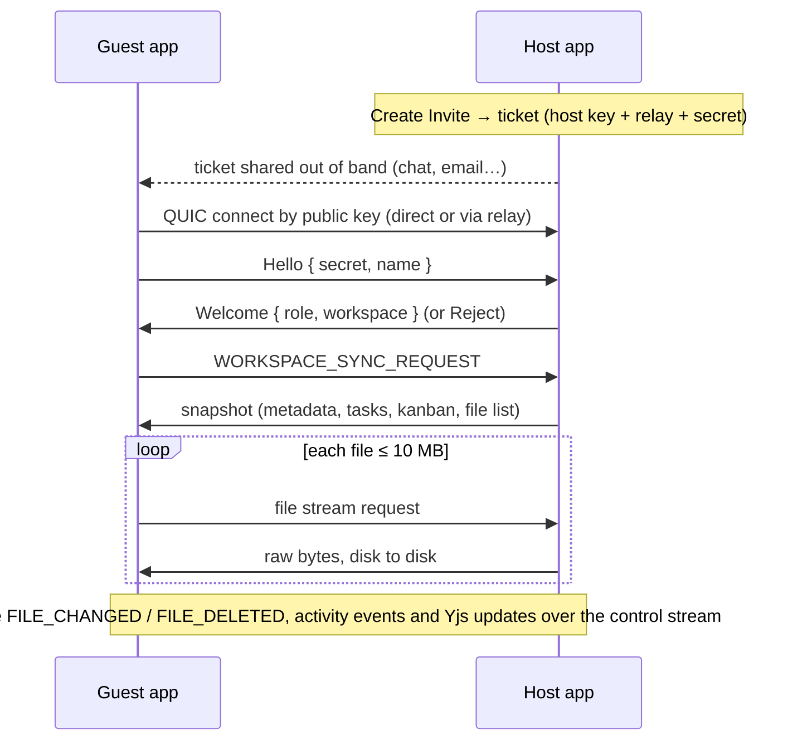

# Nexsync

Nexsync is a **local-first, peer-to-peer collaborative workspace** desktop app. Notes, code, files and assets live as normal files on your disk; tasks, kanban boards and workspace metadata live in a per-workspace SQLite database. When you want to work with someone, you share an invite and your two apps connect **directly to each other**, with no account, cloud storage or central server holding your data.

Built with [Tauri 2](https://tauri.app) (Rust) + React 19 + TypeScript, with peer-to-peer networking by [Iroh](https://www.iroh.computer).

## Features

- **Workspaces on your own disk.** Each workspace is a regular folder (`notes/`, `files/`, `assets/`, `editor/`) plus a hidden `.nexsync/` database.
- **Files, Notes and Editor.** File explorer with a BlockNote rich-text editor for Markdown and CodeMirror for code.
- **Tasks and Kanban** stored in SQLite, with a dashboard and activity feed.
- **Assets** with previews, uploads and lazy on-demand download of large files from collaborators.
- **P2P collaboration:**
    - Invite a collaborator with a single copy-pasteable ticket.
    - Connects across NATs and firewalls, with end-to-end encryption.
    - The guest gets a full copy of the workspace; after that, notes, files, tasks and kanban boards sync live in both directions.
    - Guests appear in the host's **Members** list automatically, with their invite role and an **Online** badge while connected.
- **Live co-editing.** Open the same note or file as a collaborator and edit it together in real time — a Yjs CRDT keeps BlockNote and CodeMirror in sync character-by-character, persisted locally so a reload never loses in-flight edits.
- **Roles that are actually enforced.** Owner, Editor and Viewer are checked both in the UI (a Viewer never sees create/edit/delete controls) and on the wire (the host drops a Viewer's changes even if a modified client tries to send them anyway).
- **Auto-updates.** Signed release builds are checked for and installed from inside the app (Settings → About).

## How peer-to-peer works

All networking runs in the Rust backend (`src-tauri/src/commands/p2p/`). The React app only calls Tauri commands and listens for `p2p://*` events.

- **Identity:** each app instance runs one Iroh endpoint, identified by a public key.
- **Connectivity:** Iroh first tries to punch a direct UDP path between the two devices. If that's impossible (strict NAT, carrier-grade NAT, mobile hotspot, campus network), traffic goes through an **encrypted relay**. The relay only forwards encrypted bytes. The UI shows whether each peer is **Direct** or **Relayed**.
- **Encryption:** every connection is QUIC with TLS 1.3, authenticated by the peers' keys.
- **Invites:** a ticket (`nexsync…`) contains the host's key, home relay, a few IP hints and a random 128-bit secret. The guest proves it has the ticket by sending the secret _inside_ the encrypted connection. Creating a new invite or pressing **Stop** invalidates the previous ticket.
- **Live task and kanban sync:** every task or card you create, edit, move or delete is sent to collaborators as a small change message and applied to their SQLite database. The host also shares its member list, so everyone sees who is in the workspace.
- **Live file sync:** each app watches its open workspace. When a file changes, peers are told its path, size and content hash, and download it only if their copy differs. Deleted files are moved to `.nexsync/trash/` on the other side rather than destroyed. The host re-announces what it receives, so every guest stays in sync.
- **Live co-editing:** when two people open the same note or file, keystrokes flow over the same control stream as a Yjs CRDT update, merged automatically instead of one save overwriting the other. Cursor/presence state rides along the same channel. Guests only ever connect to the host, so the host relays these updates (and a Viewer's are dropped, never applied) the same way it already relays task, kanban and file changes.



Files larger than 10 MB are not copied during the initial sync. They show up as **Remote** placeholders in Assets and download when you open them.

## Getting started

### Prerequisites

- [Node.js](https://nodejs.org) 22+ and [pnpm](https://pnpm.io) 9+
- [Rust](https://rustup.rs) (stable)
- Tauri's system dependencies for your OS: see [Tauri prerequisites](https://tauri.app/start/prerequisites/). On Windows this is the WebView2 runtime and the MSVC build tools.

### Run in development

```bash
pnpm install
```

```bash
pnpm tauri dev
```

### Build installers

```bash
pnpm tauri build
```

Bundles are written to `src-tauri/target/release/bundle/`.

CI is split into two workflows:

- **`.github/workflows/build.yml`** builds unsigned Linux (`.AppImage`, `.deb`), Windows (`.msi`, `.exe`) and macOS (universal `.dmg`) bundles and uploads them as workflow artifacts. It does **not** run on every push — only on a manual trigger (Actions tab, or `gh workflow run "Build App"`) or when a commit message contains `[build]`.
- **`.github/workflows/release.yml`** cuts an actual signed GitHub Release with auto-update artifacts. It only runs on a `v*` tag push (`git tag v0.2.0 && git push --tags`) or manual dispatch, and lands as a **draft** for review before it goes public.

### Auto-updates

The app checks GitHub Releases for a newer signed build from **Settings → About → Check for Updates**, downloads it, and relaunches. Releases are signed with a minisign keypair (the public half lives in `src-tauri/tauri.conf.json`); `release.yml` needs `TAURI_SIGNING_PRIVATE_KEY` and `TAURI_SIGNING_PRIVATE_KEY_PASSWORD` set as repo secrets to produce a release the updater will trust. Windows/macOS code signing is wired the same way (`WINDOWS_CERTIFICATE*`, `APPLE_*` secrets) but no signing identity is configured yet — builds are unsigned until those are added.

## Collaborating with someone

Both people need Nexsync running and an internet connection. Being on the same network is optional.

**Host (the person sharing a workspace):**

1. Open the workspace and click **P2P Sync** in the header (or **Members → P2P Sync & Invite**).
2. Pick **Editor** or **Viewer**, then click **Create Invite**.
3. Click **Copy** and send the invite to your collaborator however you like.
4. Keep Nexsync open with that workspace. The dialog shows when they connect.

**Guest (the person joining):**

1. On the Welcome screen click **Join Workspace**.
2. Paste the invite, choose where to store your copy, and enter your name.
3. Click **Connect & Join Workspace**. Nexsync creates a local copy, then downloads the host's tasks, kanban board and files.

If you already have the synced workspace open, use **P2P Sync → Join with Invite** instead. **Peers → Pull from Host** fetches the latest snapshot again.

**Troubleshooting**

- _"Timed out reaching the host"_: the host closed the app, switched workspaces, or one of you is offline.
- _"This invite has expired or been replaced"_: the host created a newer invite or pressed Stop. Ask for a fresh one.
- The first time Nexsync opens a network connection, Windows or macOS may ask whether to allow it. Allowing it on private networks enables direct (non-relayed) connections.
- The storage folder you pick must be inside an allowed root (Documents or your home folder by default, configurable in **Settings**).

## Security model

- Only someone holding a current invite can join, and each invite secret is 128 bits of randomness checked in constant time.
- Peers can read only files inside `notes/`, `files/`, `assets/` and `editor/` of the workspace that is currently open. Hidden files and the `.nexsync/` database are never served, and every path is checked against traversal.
- Closing or switching workspaces disconnects all peers and revokes the invite.
- A guest applies a workspace snapshot only if it asked for one, so a peer can't push changes into your workspace unprompted.
- A host ignores file, task, kanban **and live-editing** changes from guests invited as **Viewer** — enforced on the host, not just hidden in the guest's UI, so a modified client can't bypass it by sending raw messages directly. Only the host can change the member list or workspace settings.
- Files deleted by a collaborator are moved into your workspace's `.nexsync/trash/` folder, so a mistake on their side can be undone on yours.
- Relays and discovery use n0's public infrastructure. They can see that two endpoint keys are talking, but not what they say.
- Release builds are signed (minisign) and the app only installs an update whose signature matches the public key baked into the app; an attacker controlling GitHub Releases without the private key can't push a malicious update.

## Current limitations

- **Star topology:** guests talk only to the host, which relays file, task, kanban, activity and live-editing changes on to the other guests. If the host goes offline, guests can't reach each other.
- **Live co-editing has no presence UI yet:** cursor/selection data is relayed and applied, but nothing outside the open editor reads it — no "who's viewing this file" indicator on the Members page yet.
- **CodeMirror's undo is CRDT-aware, but a rename mid-edit only migrates the collaboration state for files, not folders**, and the very first time two people open a never-before-collaborated file at almost the same instant, both may seed it independently (harmless once anyone edits it once).
- **Last writer wins, outside a live session:** a plain file save (not currently open together) or a re-pull from the host still replaces the other side's copy of files ≤ 10 MB rather than merging.
- **Offline changes aren't reconciled:** edits made while disconnected sync only when the file or task changes again, or via **Pull from Host**. Pulling adds and updates tasks and cards but doesn't remove ones deleted while you were offline.
- **Trash isn't emptied automatically:** clear `.nexsync/trash/` yourself if it grows.
- **Public relays:** n0's public relays are meant for development and light use. A production deployment should run its own [iroh-relay](https://github.com/n0-computer/iroh).
- **No code-signing identity configured yet:** Windows/macOS release builds are unsigned until certificates are added as repo secrets, so installers will trigger OS-level "unknown publisher" warnings.

## Project structure

```
src/                         React frontend
  components/                UI components and dialogs (P2PConnectDialog, JoinWorkspaceDialog, …)
  components/elements/editor/ BlockNote + CodeMirror editors, collaboration-aware (EditorContainer)
  pages/                     Welcome, Settings and workspace pages
  store/workspace/           Workspace state (WorkspaceContext)
  store/p2p/                 P2P state: peers, invites, snapshot sync, roles (P2PContext)
  hooks/useCollabDoc.ts       Binds a file to a live, P2P-synced, SQLite-persisted Yjs doc
  hooks/useAppUpdater.ts      Wraps the updater plugin's check / install / relaunch flow
  lib/tauri.ts               Typed wrappers for backend commands
  lib/p2p/                   P2P transport bridge, message types, Yjs sync + awareness provider
  lib/yjs/                   Yjs → SQLite persistence provider
src-tauri/src/
  commands/workspace/        Workspace lifecycle, filesystem, tasks, kanban, Yjs storage
  commands/p2p/              Iroh node, invite tickets, wire protocol, file streaming
  commands/config.rs         Allowed workspace roots
  commands/path_utils.rs     Path sandboxing
  database/                  SQLite connection and schema migrations
.github/workflows/
  build.yml                  Manual/opt-in cross-platform build (unsigned artifacts)
  release.yml                Tag-triggered signed release + auto-update feed
```

## Testing

Checks run from `src-tauri/`:

```bash
cargo test
```

The end-to-end P2P test starts a real host and guest over the Iroh network. It checks joining, two-way messaging, file streaming, rejection of forged and revoked invites, and disconnect handling. It needs internet access, so it's skipped by default:

```bash
cargo test test_host_and_guest_end_to_end -- --ignored
```

Frontend type-check and production build:

```bash
pnpm build
```
